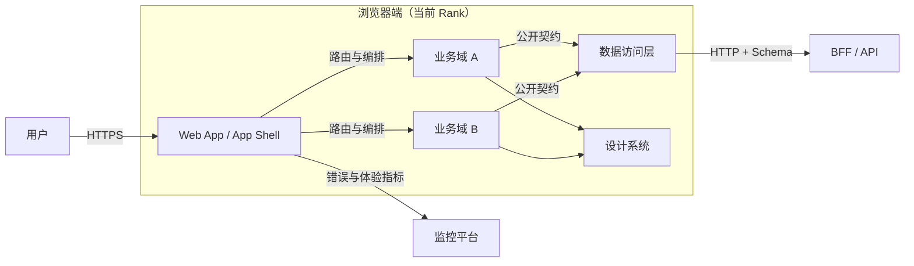
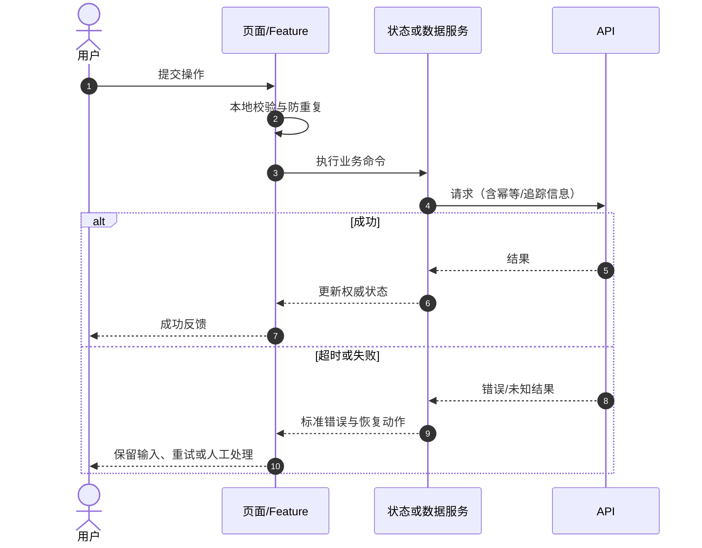
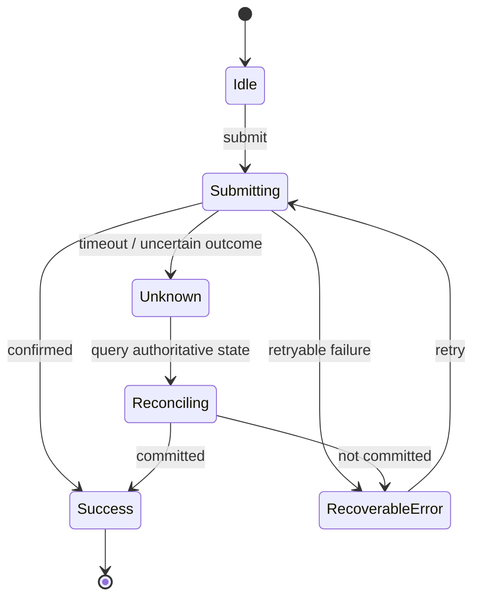
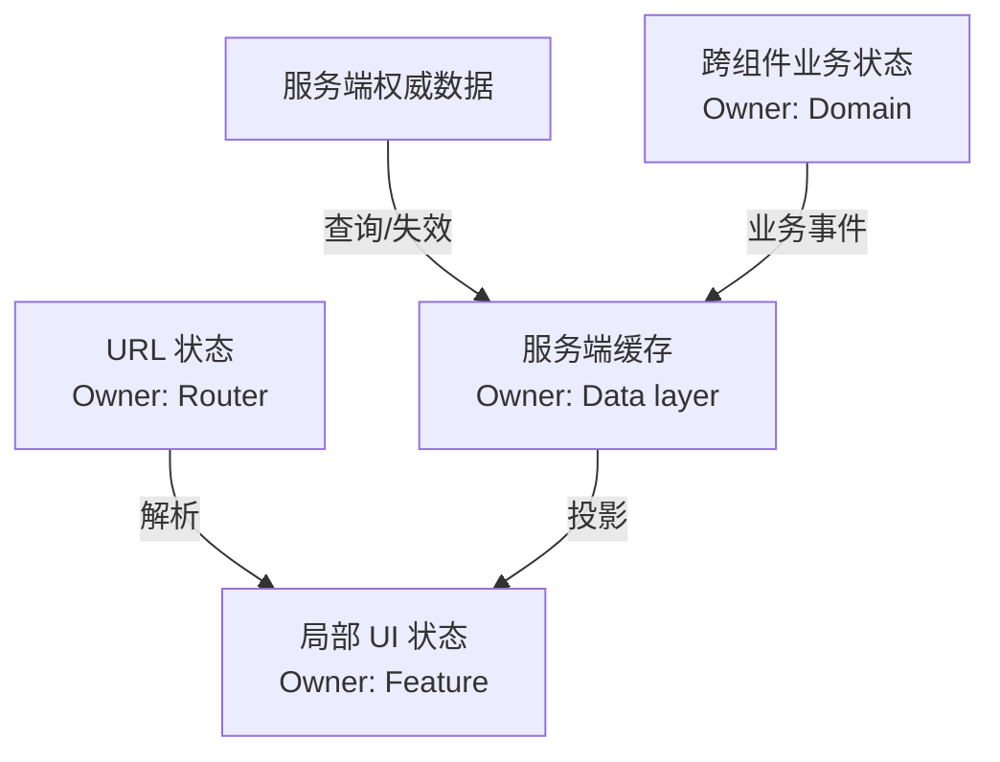
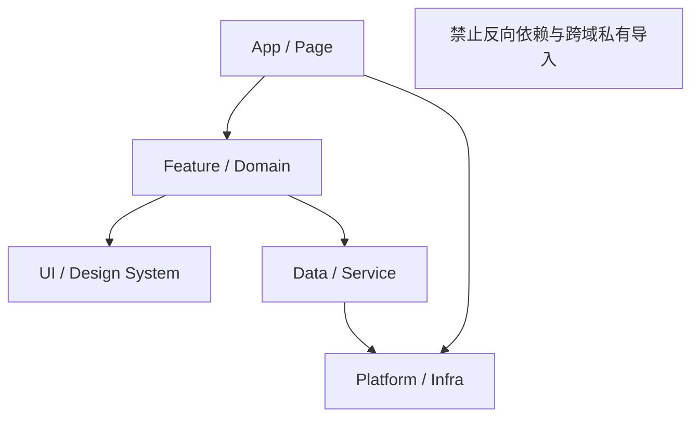
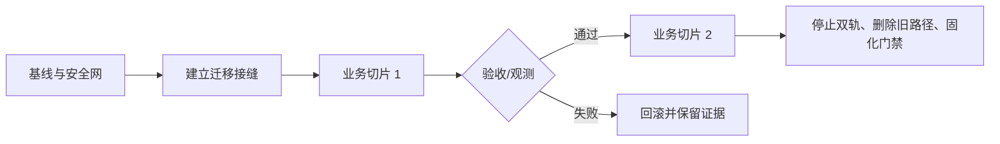

# 前端架构可视化指南

图表用于回答问题和支撑决策，不用于展示工具熟练度。先明确受众、问题和 Rank，再选最小图表。示例以 Mermaid 为主；具体语法与渲染能力需在目标平台验证。

## 目录

- [选图规则](#选图规则)
- [用 4R 画图](#用-4r-画图)
- [图表模板](#图表模板)
- [C4 使用边界](#c4-使用边界)
- [可读性与验证](#可读性与验证)
- [交付清单](#交付清单)

## 选图规则

| 要回答的问题 | 推荐图 | 不应混入 |
|---|---|---|
| 系统与用户/外部系统的边界 | Context/上下文图 | 源码文件和内部类 |
| 应用、服务、包或部署单元如何协作 | Container/系统结构图 | 每个组件细节 |
| 一个模块内部的主要职责与依赖 | Component/模块图 | 整个企业系统 |
| 核心场景如何运行 | 时序图 | 与场景无关的静态结构 |
| 状态、并发、失败与恢复 | 状态图 | 大量 UI 布局 |
| 数据或事件如何流动和归属 | 数据流图 | 不相关基础设施 |
| 制品如何构建、发布和运行 | 部署/流水线图 | 业务规则细节 |
| 决策、迁移或故障的先后关系 | 流程图/时间线 | 所有架构层级 |

如果两三句话或一张表更清晰，就不画图。

## 用 4R 画图

1. **Rank**：在标题或图注声明当前层级和范围；一张图通常只展示当前层和必要的相邻层。
2. **Role**：只保留回答当前问题的角色；名称使用业务/职责语义，不用模糊的 `Manager`、`Common`、`Utils`。
3. **Relation**：箭头标明方向、协议/依赖、关键数据或同步/异步语义。
4. **Rule**：另用时序图或状态图说明关键场景，包括失败、超时、重试和回滚。

图前写一句“这张图帮助谁做什么决策”，图后写 2–4 条关键观察。没有图注的图很容易被不同读者误解。

## 图表模板

### 系统结构图

图注应补充：谁拥有各业务域、是否同仓/同部署、公开契约在哪里验证。

### 核心用户流程序列图

不要把拦截器、数据库和所有后端内部步骤都塞入前端决策图，除非它们影响当前 Rule。

### 状态图

状态图重点标明权威状态、不可逆动作、并发和恢复，不只画 loading/success/error 三个框。

### 数据所有权图

若存在双写或复制，标出同步方向、冲突规则和计划移除时间。

### 依赖方向图

图后说明如何执行：package exports、lint、依赖图、构建边界或 code owners。

### 渐进迁移图

## C4 使用边界

C4 的 Context、Container、Component、Code 是抽象层级，不等同于前端的组件命名：

- Context：人与软件系统的关系；
- Container：可独立运行/部署的数据存储或应用单元；不要把每个页面都叫 Container；
- Component：Container 内的主要职责单元；
- Code：实现细节，通常不需要放进架构评审。

Mermaid 的 C4 语法、Structurizr DSL 和 diagrams.net 的支持随工具版本变化。交付前在目标渲染器验证；不确定时用基础 flowchart/sequenceDiagram，兼容性更好。

## 可读性与验证

### 可读性

- 节点名称用“名词 + 职责”，边用“动词/协议 + 数据”；
- 正常流、异步流、错误流的样式要有图例，不只靠颜色；
- 避免交叉线；超过约 12–15 个主要节点时考虑拆图，但以读者理解为准；
- 颜色要有足够对比度，并确保黑白打印仍能辨认；
- 不在图里写未经证实的版本、SLO、拓扑或所有权。

### 验证

1. 语法在目标平台可渲染；
2. 节点和关系能追溯到代码、配置、部署或明确方案；
3. 图与正文使用相同术语；
4. 关键失败路径没有被省略；
5. 图中边界与实际 owner/部署/依赖一致；
6. 日期、状态和适用版本可追溯。

## 交付清单

- [ ] 标题包含范围和 Rank；
- [ ] 写明受众与要回答的问题；
- [ ] 静态图只表达必要 Role/Relation；
- [ ] 核心 Rule 有时序图、状态图或决策表；
- [ ] 协议、方向、数据和失败语义清晰；
- [ ] 推断与目标态没有画成已存在事实；
- [ ] 在目标渲染器验证；
- [ ] 图后有关键观察、决策或待验证项。
